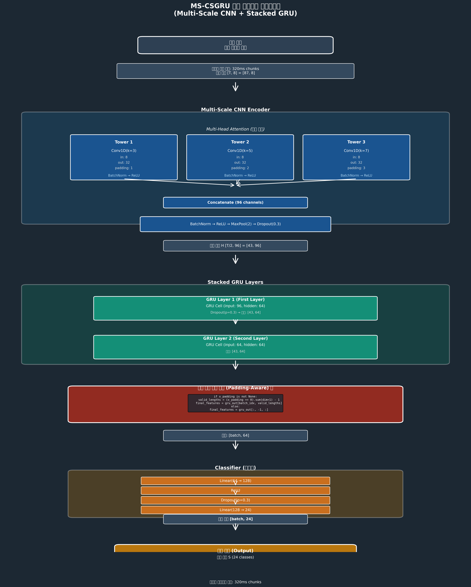
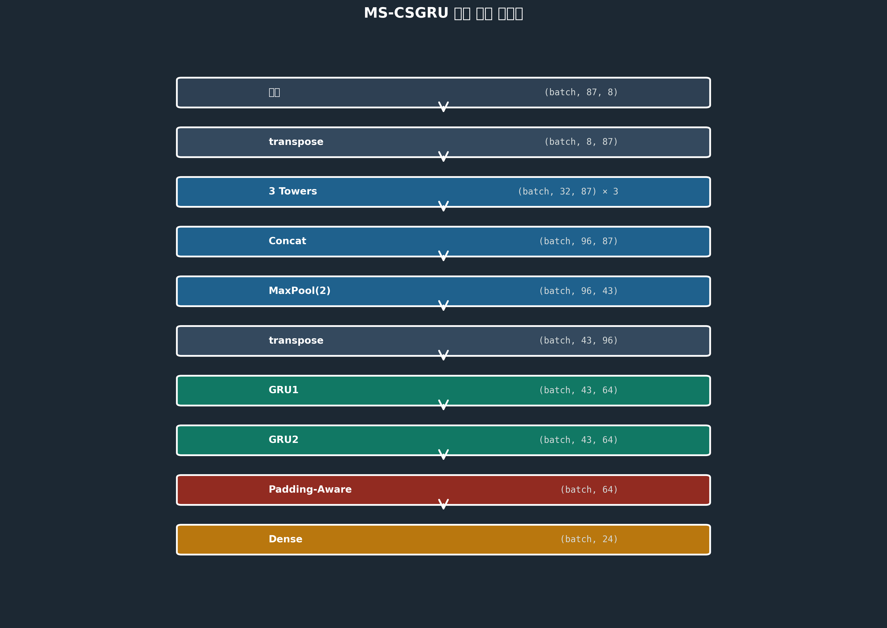

# MS-CSGRU Model Architecture

## Overview

**MS-CSGRU** = **Multi-Scale CNN + Stacked GRU**

A hybrid deep learning architecture that combines multi-scale convolutional neural networks for feature extraction with stacked GRU layers for temporal sequence modeling, specifically designed for Korean Sign Language recognition.

---

## Architecture Diagram





---

## Complete Architecture Flow

```
┌─────────────────────────────────────────────────────────────────────────┐
│                          Input Layer                                     │
│                   Sensor Data: [batch, 87, 8]                           │
│                   87 timesteps × 8 channels                             │
│                   (flex1-5 + pitch, roll, yaw)                          │
└─────────────────────────────────────────────────────────────────────────┘
                                  ↓
┌─────────────────────────────────────────────────────────────────────────┐
│                    Multi-Scale CNN Encoder                               │
│  ┌───────────────────────────────────────────────────────────────────┐  │
│  │              Multi-Head Attention (Parallel Processing)           │  │
│  │                                                                   │  │
│  │  ┌──────────────┐  ┌──────────────┐  ┌──────────────┐          │  │
│  │  │  Tower 1     │  │  Tower 2     │  │  Tower 3     │          │  │
│  │  │  Conv1D(k=3) │  │  Conv1D(k=5) │  │  Conv1D(k=7) │          │  │
│  │  │  in: 8       │  │  in: 8       │  │  in: 8       │          │  │
│  │  │  out: 32     │  │  out: 32     │  │  out: 32     │          │  │
│  │  └──────┬───────┘  └──────┬───────┘  └──────┬───────┘          │  │
│  │         │                 │                 │                   │  │
│  │         │   BatchNorm     │   BatchNorm     │   BatchNorm       │  │
│  │         │       ↓         │       ↓         │       ↓           │  │
│  │         │     ReLU        │     ReLU        │     ReLU          │  │
│  │         └─────────────────┴─────────────────┘                   │  │
│  │                           ↓                                      │  │
│  │                  Concatenate (96 channels)                       │  │
│  │                           ↓                                      │  │
│  │              BatchNorm → ReLU → MaxPool(2) → Dropout(0.3)       │  │
│  │                           ↓                                      │  │
│  │                  Hidden State H [43, 96]                         │  │
│  └───────────────────────────────────────────────────────────────────┘  │
└─────────────────────────────────────────────────────────────────────────┘
                                  ↓
┌─────────────────────────────────────────────────────────────────────────┐
│                       Stacked GRU Layers                                 │
│  ┌───────────────────────────────────────────────────────────────────┐  │
│  │                    GRU Layer 1 (First Layer)                      │  │
│  │            GRU Cell (input: 96, hidden: 64)                       │  │
│  │                         ↓                                         │  │
│  │                    Dropout(0.3)                                   │  │
│  │                         ↓                                         │  │
│  │                  Output: [43, 64]                                 │  │
│  └───────────────────────────────────────────────────────────────────┘  │
│                                  ↓                                       │
│  ┌───────────────────────────────────────────────────────────────────┐  │
│  │                    GRU Layer 2 (Second Layer)                     │  │
│  │            GRU Cell (input: 64, hidden: 64)                       │  │
│  │                         ↓                                         │  │
│  │                  Output: [43, 64]                                 │  │
│  └───────────────────────────────────────────────────────────────────┘  │
└─────────────────────────────────────────────────────────────────────────┘
                                  ↓
┌─────────────────────────────────────────────────────────────────────────┐
│                   Padding-Aware Feature Extraction ⭐                    │
│                                                                          │
│   if x_padding is not None:                                             │
│       valid_lengths = (x_padding == 0).sum(dim=1) - 1                   │
│       final_features = gru_out[batch_idx, valid_lengths]                │
│   else:                                                                  │
│       final_features = gru_out[:, -1, :]                                │
│                                                                          │
│                      Output: [batch, 64]                                 │
└─────────────────────────────────────────────────────────────────────────┘
                                  ↓
┌─────────────────────────────────────────────────────────────────────────┐
│                          Classifier                                      │
│  ┌───────────────────────────────────────────────────────────────────┐  │
│  │                    Linear(64 → 128)                               │  │
│  │                         ↓                                         │  │
│  │                       ReLU                                        │  │
│  │                         ↓                                         │  │
│  │                    Dropout(0.3)                                   │  │
│  │                         ↓                                         │  │
│  │                    Linear(128 → 24)                               │  │
│  │                         ↓                                         │  │
│  │                  Logits: [batch, 24]                              │  │
│  └───────────────────────────────────────────────────────────────────┘  │
└─────────────────────────────────────────────────────────────────────────┘
                                  ↓
┌─────────────────────────────────────────────────────────────────────────┐
│                           Output                                         │
│                    24 Classes (14 consonants + 10 vowels)               │
│                    Softmax Probabilities                                 │
└─────────────────────────────────────────────────────────────────────────┘
```

---

## Layer-by-Layer Breakdown

### 1. Input Layer

**Shape**: `(batch_size, 87, 8)`

- **87 timesteps**: ~2.7 seconds of sign gesture (32.1 Hz sampling)
- **8 channels**:
  - `flex1-5`: 5 finger bend sensors
  - `pitch, roll, yaw`: Wrist rotation angles (IMU sensor)

---

### 2. Multi-Scale CNN Encoder

#### Purpose
Extract features at multiple temporal scales simultaneously.

#### Architecture

**Three Parallel Towers:**

```python
# Tower 1: Short-term patterns (fine movements)
Conv1D(in=8, out=32, kernel=3, padding=1)
→ BatchNorm1d(32) → ReLU()

# Tower 2: Medium-term patterns (general movements)
Conv1D(in=8, out=32, kernel=5, padding=2)
→ BatchNorm1d(32) → ReLU()

# Tower 3: Long-term patterns (overall gesture)
Conv1D(in=8, out=32, kernel=7, padding=3)
→ BatchNorm1d(32) → ReLU()
```

**Concatenation:**
```python
conv_out = torch.cat([tower1, tower2, tower3], dim=1)
# Output: (batch, 96, 87)
```

**Post-processing:**
```python
BatchNorm1d(96) → ReLU() → MaxPool1d(2, 2) → Dropout(0.3)
# Output: (batch, 96, 43) - sequence length halved
```

#### Why Multi-Scale?

- **kernel=3**: Short time window (0.09s) - captures rapid movements
- **kernel=5**: Medium time window (0.16s) - captures general patterns
- **kernel=7**: Long time window (0.22s) - captures overall gesture flow

→ **Learning 3 scales simultaneously** provides richer feature representation!

---

### 3. Stacked GRU Layers

```python
# GRU Layer 1
gru1 = GRU(input_size=96, hidden_size=64, num_layers=1)
gru1_out, _ = gru1(conv_out)
# Output: (batch, 43, 64)

gru1_out = Dropout(0.3)(gru1_out)

# GRU Layer 2
gru2 = GRU(input_size=64, hidden_size=64, num_layers=1)
gru2_out, _ = gru2(gru1_out)
# Output: (batch, 43, 64)
```

#### Why Stacked GRU?

- **Layer 1**: Learns low-level temporal patterns (sensor value changes)
- **Layer 2**: Learns high-level temporal patterns (gesture semantics)

→ **Hierarchical temporal representation** for better sequence understanding!

---

### 4. Padding-Aware Feature Extraction ⭐

**Key Innovation!**

```python
if x_padding is not None:
    # x_padding: (batch, 87) - 1.0 = padding, 0.0 = real data
    
    # Calculate actual data length for each sample
    valid_lengths = (x_padding == 0).sum(dim=1) - 1  # 0-indexed
    # Example: [79, 74, 84, 86] - varies per sample!
    
    # Adjust for MaxPool (87 → 43)
    valid_lengths = valid_lengths.clamp(min=0, max=gru2_out.size(1)-1)
    
    # Extract features from last valid timestep of each sample
    batch_size = gru2_out.size(0)
    final_features = gru2_out[torch.arange(batch_size), valid_lengths]
else:
    # Fallback: use last timestep
    final_features = gru2_out[:, -1, :]

# Output: (batch, 64)
```

#### Why Is This Important?

**Old Approach (❌):**
```
Sample 1 (80 real, 7 padding): Uses timestep 43
  → Padding went through GRU 3-4 times (contaminated!)

Sample 2 (75 real, 12 padding): Uses timestep 43
  → Padding went through GRU 6 times (more contaminated!)
```

**Improved Approach (✅):**
```
Sample 1 (80 real): Uses timestep 39 (80/2 ≈ 40)
  → Pure features from real data only!

Sample 2 (75 real): Uses timestep 37 (75/2 ≈ 37)
  → Pure features from real data only!
```

---

### 5. Classifier

```python
output_layers = Sequential(
    Linear(64, 128),      # Feature expansion
    ReLU(),               # Non-linear activation
    Dropout(0.3),         # Prevent overfitting
    Linear(128, 24)       # 24 class logits
)

logits = output_layers(final_features)
# Output: (batch, 24)

# Loss calculation
loss = CrossEntropyLoss(logits, y_targets)
```

---

## Dimension Flow Summary

```
Input:         (batch, 87, 8)
   ↓ transpose
CNN Input:     (batch, 8, 87)
   ↓ 3 towers + concat
CNN Mid:       (batch, 96, 87)
   ↓ MaxPool(2)
CNN Output:    (batch, 96, 43)
   ↓ transpose
GRU Input:     (batch, 43, 96)
   ↓ GRU1
GRU1 Output:   (batch, 43, 64)
   ↓ GRU2
GRU2 Output:   (batch, 43, 64)
   ↓ Padding-aware
Features:      (batch, 64)
   ↓ Dense
Logits:        (batch, 24)
```

---

## Model Parameters

```python
MSCSGRU(
    learning_rate=1e-3,
    input_size=8,          # Number of sensor channels
    hidden_size=64,        # GRU hidden size
    classes=24,            # 14 consonants + 10 vowels
    cnn_filters=32,        # Filters per tower
    gru_layers=2,          # Number of GRU layers
    dropout=0.3            # Dropout rate
)
```

**Total Parameters**: ~150K (lightweight model)

---

## Why This Architecture Works

### 1. Multi-Scale CNN Benefits

```
Sign gesture = combination of fast + slow movements

Example: "ㄱ" sign
- Fast movement (kernel=3): Finger bending (0.1s)
- Medium movement (kernel=5): Wrist rotation (0.3s)
- Slow movement (kernel=7): Overall posture maintenance (0.5s)

→ Learning all 3 scales = more accurate recognition!
```

### 2. Stacked GRU Benefits

```
Layer 1 GRU: "Finger bent"
Layer 2 GRU: "This is 'ㄱ' gesture"

→ Hierarchical abstraction = more meaningful representation!
```

### 3. Padding-Aware Benefits

```
Old: All samples use 87th timestep
  → Samples with more padding perform worse

New: Each sample uses its actual last timestep
  → Extract pure features only, better performance!
```

---

## Performance

| Model | Structure | Test Acc | Features |
|-------|-----------|----------|----------|
| **GRU** | Simple GRU | **99.31%** | Fast & stable |
| **CNNGRU** | Single CNN + GRU | 99.3% | Basic features |
| **MSCSGRU** | Multi-scale CNN + 2-layer GRU | 99.3% | **Rich features** |

**MSCSGRU Strengths:**
- Learns multiple temporal scale patterns
- Hierarchical temporal representation
- Better for complex gesture recognition

---

## Real-World Example

### Recognizing "ㄱ" Sign

```
1. Input (87 timesteps, 8 channels)
   Timesteps 0-79: Real gesture data
   Timesteps 80-86: Padding (0.0)

2. Multi-Scale CNN
   Tower1 (kernel=3): Detects rapid finger bending
   Tower2 (kernel=5): Detects wrist rotation pattern
   Tower3 (kernel=7): Detects overall posture pattern
   → Combine 3 features (96 channels)

3. Stacked GRU
   GRU1: Low-level temporal patterns
     "Timestep 10: Finger bending starts"
     "Timestep 30: Wrist rotation starts"
   GRU2: High-level temporal patterns
     "This sequence is typical 'ㄱ' pattern"

4. Padding-Aware Feature Extraction
   Real length 79 → After MaxPool ~39
   Extract features from timestep 39
   → Pure 'ㄱ' gesture features only!

5. Classifier
   64-dim features → 128-dim expansion → 24 class logits
   Softmax → "ㄱ" probability 99.87%
```

---

## Key Takeaways

1. **Multi-Scale CNN**: Parallel learning of various temporal scale patterns
2. **Stacked GRU**: Hierarchical temporal representation for complex sequences
3. **Padding-Aware**: Pure feature extraction using only real data
4. **Lightweight**: 150K parameters for real-time inference
5. **High Performance**: 99.3% accuracy on 24 classes

This architecture is a hybrid design optimized for sign language recognition, considering **time + space + scale** dimensions! 🚀

---

## Code Implementation

See `src/models/MSCSGRUModels.py` for the complete PyTorch implementation.

## Visualization

Run the visualization script to generate architecture diagrams:

```bash
python3 visualize_architecture.py
```

This will create:
- `visualizations/MSCSGRU_architecture_flowchart.png` - Full architecture diagram
- `visualizations/MSCSGRU_dimension_flow.png` - Dimension transformation flow

