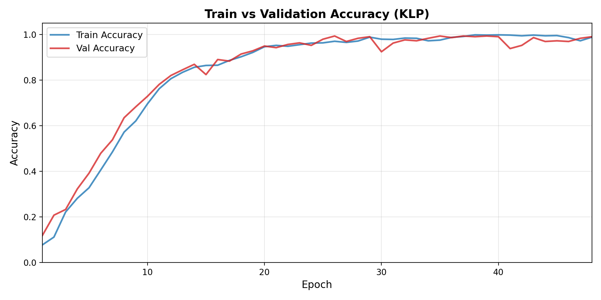

# KLP-SignGlove: 한국어 수화 인식 프로젝트 🤟

한국어 수화 자모(자음, 모음) 인식을 위한 센서 장갑 기반 실시간 분류 시스템입니다.

## 🎯 프로젝트 개요

**목표**: 한국어 수화 자모 24개 클래스(자음 14개 + 모음 10개)를 실시간으로 인식하는 시스템 개발

**특징**: 
- **멀티스케일 CNN + GRU 하이브리드 모델**: 다양한 시간 스케일의 패턴을 동시에 학습
- **3가지 핵심 모델**: GRU, CNNGRU, MSCSGRU (99% 이상 정확도)
- **모듈화된 구조**: 학습, 추론, 시각화가 분리된 체계적인 구조
- **실시간 추론 시스템**: 단일 샘플 예측 및 배치 추론 지원
- **완전한 시각화**: 학습 곡선, 혼동 행렬, 클래스별 성능 분석

## 📊 데이터셋 정보

### SignGlove (우리) 데이터셋
- **총 샘플 수**: 1,444개
- **클래스 수**: 24개 (자음 14개 + 모음 10개)
- **타임스텝**: 87개
- **센서 채널**: 8개 (flex1-5 + pitch, roll, yaw)
- **샘플링 주파수**: 32.1 Hz
- **데이터 분할**: 훈련 60%, 검증 20%, 테스트 20%
- **전처리 방식**: 제로 패딩(0.0) + StandardScaler 정규화

### 클래스 목록
- **자음 (14개)**: ㄱ, ㄴ, ㄷ, ㄹ, ㅁ, ㅂ, ㅅ, ㅇ, ㅈ, ㅊ, ㅋ, ㅌ, ㅍ, ㅎ
- **모음 (10개)**: ㅏ, ㅑ, ㅓ, ㅕ, ㅗ, ㅛ, ㅜ, ㅠ, ㅡ, ㅣ

## 🏗️ 모델 아키텍처

### 1. CNN-GRU (Single-scale CNN + Single GRU)
```python
Conv1D(kernel=3) → BatchNorm → ReLU → MaxPool → Dropout
         ↓
Single GRU(64) → Dropout → Dense(128) → Dense(24)
```

### 2. CNN-StackedGRU (Single-scale CNN + Stacked GRU)
```python
Conv1D(kernel=3) → BatchNorm → ReLU → MaxPool → Dropout
         ↓
GRU1(64) → Dropout → GRU2(64) → Dropout → Dense(128) → Dense(24)
```

### 3. MS-GRU (Multi-scale CNN + Single GRU)
```python
Tower1(kernel=3) ┐
Tower2(kernel=5) ├→ Concat → BatchNorm → ReLU → MaxPool → Dropout
Tower3(kernel=7) ┘
         ↓
Single GRU(64) → Dropout → Dense(128) → Dense(24)
```

### 4. MS-StackedGRU (Multi-scale CNN + Stacked GRU)
```python
Tower1(kernel=3) ┐
Tower2(kernel=5) ├→ Concat → BatchNorm → ReLU → MaxPool → Dropout
Tower3(kernel=7) ┘
         ↓
GRU1(64) → Dropout → GRU2(64) → Dropout → Dense(128) → Dense(24)
```

## 📁 프로젝트 구조

```
KLP-SignGlove-Clean/
├── src/
│   ├── models/                      # 모델 구현
│   │   ├── MSCSGRUModels.py        # 멀티스케일 CNN-GRU 모델
│   │   ├── GRUModels.py            # GRU 기반 모델들
│   │   ├── LSTMModels.py           # LSTM 관련 모델들
│   │   ├── EncoderModels.py        # 인코더 모델들
│   │   ├── generalModels.py        # 공통 모델 클래스
│   │   └── LightningModel.py       # PyTorch Lightning 기본 클래스
│   ├── experiments/                # 학습 관련
│   │   ├── LightningTrain.py       # 학습 메인 스크립트
│   │   ├── ModelTrain.sh           # 학습 실행 셸 스크립트
│   │   └── checkpoints/            # 학습된 모델 체크포인트
│   └── misc/
│       ├── DynamicDataModule.py    # 데이터 로더 및 전처리
│       ├── data_preprocessor.py    # 데이터 전처리 유틸
│       └── dataset.py              # 데이터셋 클래스
│
├── inference/                      # 추론 시스템 (완성 ✅)
│   ├── engine.py                   # 추론 엔진 (SignGloveInference)
│   ├── examples/
│   │   └── single_predict.py       # 단일 샘플 예측 예제
│   ├── models/                     # 추론용 모델 래퍼
│   ├── utils/                      # 추론 유틸리티
│   ├── inference_visualizations/   # 추론 결과 시각화 (NEW!)
│   │   ├── confusion_matrix.png           # 혼동 행렬
│   │   ├── confusion_matrix_normalized.png # 정규화된 혼동 행렬
│   │   ├── per_class_accuracy.png         # 클래스별 정확도
│   │   ├── per_class_confidence.png       # 클래스별 신뢰도
│   │   ├── confidence_distribution.png    # 신뢰도 분포
│   │   └── confidence_scatter.png         # 신뢰도 산점도
│   └── README.md                   # 추론 시스템 사용법
│
├── visualizations/                 # 학습 곡선 시각화
│   ├── GRU/
│   │   ├── train_val_loss.png      # 학습/검증 손실
│   │   └── train_val_accuracy.png  # 학습/검증 정확도
│   ├── CNNGRU/
│   └── MSCSGRU/
│
├── analyze_training.py             # 학습 결과 분석 스크립트
├── inference_visualization.py      # 추론 결과 시각화 스크립트
├── compare_models.py               # 모델 성능 비교 스크립트
├── requirements.txt                # 의존성 패키지
├── README.md                       # 프로젝트 문서
└── LICENSE                         # MIT 라이선스
```

## ⚡ 빠른 시작 (Quick Start)

**단 3분 안에 추론 실행!** 🚀

```bash
# 1. 저장소 클론
git clone https://github.com/Kyle-Riss/KLP-SignGlove.git
cd KLP-SignGlove-Clean

# 2. 의존성 설치
pip install -r requirements.txt

# 3. 데이터 준비 (SignGlove_HW 프로젝트)
git clone https://github.com/KNDG01001/SignGlove_HW.git

# ⚠️ 데이터셋 경로가 다르면 src/misc/DynamicDataModule.py 21번째 줄 수정!
# 기본 경로: /home/billy/25-1kp/SignGlove_HW/datasets/unified

# 4. 추론 실행 (3가지 방법 중 선택)

# 방법 1: 단일 샘플 예측 (가장 빠름)
python3 inference/examples/single_predict.py

# 방법 2: 배치 예측 (여러 샘플 동시 처리)
python3 inference/examples/batch_predict.py

# 방법 3: 전체 평가 + 시각화 (상세 분석)
python3 inference_visualization.py
```

**결과 확인:**
- **방법 1**: 콘솔에 5개 샘플 예측 결과 출력
- **방법 2**: 배치 단위 예측 결과 + 통계
- **방법 3**: `inference/inference_visualizations/` - 6개의 시각화 파일 + Top-1/Top-5 정확도

---

## 🚀 시작하기 (상세)

### 1. 환경 설정
```bash
# 저장소 클론
git clone https://github.com/Kyle-Riss/KLP-SignGlove.git
cd KLP-SignGlove-Clean

# 의존성 설치
pip install -r requirements.txt

# 필요 패키지:
# - torch >= 2.0.0
# - pytorch-lightning >= 2.0.0
# - numpy, pandas, matplotlib, seaborn
# - scikit-learn
```

### 2. 데이터 준비

#### 데이터셋 다운로드
SignGlove_HW 프로젝트의 unified 데이터셋을 사용합니다:
```bash
# 데이터셋 클론
git clone https://github.com/KNDG01001/SignGlove_HW.git

# 데이터셋 위치 확인
ls SignGlove_HW/datasets/unified/
```

#### ⚠️ 데이터셋 경로 설정 (중요!)

**기본 경로**: `/home/billy/25-1kp/SignGlove_HW/datasets/unified`

만약 다른 위치에 데이터셋을 다운로드했다면, 다음 파일을 수정해야 합니다:

```bash
# 1. DynamicDataModule.py 수정
vim src/misc/DynamicDataModule.py
```

**21번째 줄 수정:**
```python
def __init__(
    self,
    data_dir: str = "/YOUR/PATH/TO/SignGlove_HW/datasets/unified",  # ← 여기 수정!
    time_steps: int = 87,
    ...
)
```

**또는 학습 시 직접 경로 지정:**
```bash
# LightningTrain.py에서 직접 데이터 경로 전달
python3 src/experiments/LightningTrain.py \
    -model GRU \
    -model_type RNN \
    -data_dir /YOUR/CUSTOM/PATH/datasets/unified
```

**추론 시 경로 지정:**
```python
# inference_visualization.py 또는 single_predict.py에서
data_module = DynamicDataModule(
    data_dir="/YOUR/CUSTOM/PATH/datasets/unified",  # 커스텀 경로
    time_steps=87,
    batch_size=32
)
```

### 3. 모델 학습
```bash
# 개별 모델 학습 (자동으로 Early Stopping 적용)
cd src/experiments
bash ModelTrain.sh RNN GRU          # GRU 모델 학습
bash ModelTrain.sh MSCSGRU CNNGRU   # CNN-GRU 모델 학습
bash ModelTrain.sh MSCSGRU MSCSGRU  # 멀티스케일 CNN-GRU 학습

# 학습 결과 시각화 생성
cd ../../
python3 analyze_training.py -model GRU
python3 analyze_training.py -model CNNGRU
python3 analyze_training.py -model MSCSGRU
```

**학습 파라미터:**
- Epochs: 100 (Early Stopping 적용)
- Batch Size: 32
- Learning Rate: 1e-3
- Optimizer: Adam
- Early Stopping: patience=10, min_delta=0.001

### 4. 모델 추론 (Inference) 🎯

**3가지 추론 방법을 제공합니다:**

#### 4.1 단일 샘플 예측 (Single Sample Prediction)
```bash
# 예제 스크립트 실행
python3 inference/examples/single_predict.py

# 출력 예시:
# 📊 샘플 #1:
#   🎯 실제 정답: ㄱ (클래스 0)
#   🤖 예측 결과: ㄱ (클래스 0)
#   💯 신뢰도: 99.87%
#   ✅ 정답!
```

**용도:** 
- 실시간 추론 테스트
- 빠른 결과 확인
- 디버깅 및 검증

#### 4.2 배치 예측 (Batch Prediction)
```bash
# 배치 예측 예제 실행
python3 inference/examples/batch_predict.py

# 특징:
# - 여러 샘플 동시 처리
# - 가변 길이 입력 자동 조정
# - 대용량 데이터 청크 처리
# - 배치 통계 계산
```

**용도:**
- 여러 샘플 동시 추론
- 효율적인 처리 (배치 단위)
- 대용량 데이터 처리

#### 4.3 전체 테스트 세트 평가 + 시각화
```bash
# 전체 테스트 세트 추론 + 시각화 생성
python3 inference_visualization.py

# 생성되는 시각화 (6개):
# - confusion_matrix.png              # 혼동 행렬
# - confusion_matrix_normalized.png   # 정규화된 혼동 행렬
# - per_class_accuracy.png            # 클래스별 정확도
# - per_class_confidence.png          # 클래스별 신뢰도 분포
# - confidence_distribution.png       # 정답/오답 신뢰도 비교
# - confidence_scatter.png            # 전체 샘플 신뢰도
```

**용도:**
- 모델 성능 평가
- 상세 분석 및 시각화
- 오류 분석
- 논문/발표 자료 생성

#### 4.4 직접 추론 코드 작성 (Custom Inference)
```python
import torch
from src.models.GRUModels import GRU
from src.misc.DynamicDataModule import DynamicDataModule

# 1. 모델 로드
checkpoint_path = "src/experiments/checkpoints/best_model_epoch=57_val/loss=0.03-v2.ckpt"
model = GRU.load_from_checkpoint(
    checkpoint_path,
    input_size=8,
    hidden_size=64,
    classes=24,
    learning_rate=1e-3,
    map_location=torch.device('cpu')
)
model.eval()

# 2. 데이터 준비
data_module = DynamicDataModule(
    data_dir="/path/to/datasets/unified",
    time_steps=87,
    batch_size=32
)
data_module.setup(stage='test')
test_loader = data_module.test_dataloader()

# 3. 추론 실행
for batch in test_loader:
    x = batch['measurement']
    x_padding = batch['measurement_padding']
    y_true = batch['label']
    
    with torch.no_grad():
        logits, _ = model(x, x_padding, y_true)
        predictions = torch.argmax(logits, dim=1)
        confidences = torch.softmax(logits, dim=1).max(dim=1)[0]
    
    # 결과 활용
    for i, (pred, conf) in enumerate(zip(predictions, confidences)):
        class_name = data_module.class_names[pred.item()]
        print(f"예측: {class_name}, 신뢰도: {conf.item()*100:.2f}%")
    break  # 첫 배치만
```

### 5. 모델 성능 확인
```bash
# 학습 로그 확인
tail -20 training_output_RNN_GRU_clean.log
tail -20 training_output_MSCSGRU_CNNGRU_clean.log
tail -20 training_output_MSCSGRU_MSCSGRU_clean.log

# 시각화 확인
ls visualizations/GRU/
ls visualizations/CNNGRU/
ls visualizations/MSCSGRU/

# 추론 결과 확인
ls inference/inference_visualizations/
```

## 📈 모델 성능 비교

### 최종 학습 결과 (Early Stopping 적용)
| 모델 | Train Loss | Val Loss | Train Acc | Val Acc | Test Acc | Epochs | 특징 |
|------|------------|----------|-----------|---------|----------|--------|------|
| **GRU** | 0.027 | 0.032 | 99.7% | 99.0% | **99.31%** | 58 | ⭐ 추천: 안정적 학습 패턴 |
| **CNNGRU** | 0.138 | 0.052 | 95.3% | 99.3% | - | 100 | 큰 Loss Gap (과도한 정규화) |
| **MSCSGRU** | 0.092 | 0.043 | 98.0% | 99.3% | - | 58 | 멀티스케일 특징 추출 |

### 추론 성능 (GRU 모델 기준) 🎯
```
📊 테스트 세트 평가:
  - 총 샘플 수: 289개
  - Top-1 정확도: 99.31% (287/289)
  - Top-5 정확도: 100.00% (289/289)
  - 평균 신뢰도: 99.12%
  - 정답 샘플 평균 신뢰도: 99.26%
  - 오답 샘플 평균 신뢰도: 85.49%
  
⚠️ 가장 혼동되는 클래스 쌍:
  1. ㅁ → ㅏ: 1회 (자음 ↔ 모음, 손 모양 유사)
  2. ㅑ → ㅗ: 1회 (모음 ↔ 모음, 유사한 패턴)
```

### 모델 선택 가이드
- **🏆 프로덕션 추천**: `GRU` 
  - 정상적인 학습 패턴 (Train > Val)
  - 높은 테스트 정확도 (99.31%)
  - 일관된 성능 (Train/Val/Test 모두 99% 대)
  - 빠른 추론 속도
  
- **🔬 연구용**: `MSCSGRU`
  - 멀티스케일 특징 추출
  - 다양한 시간 패턴 학습
  - 복잡한 패턴 인식에 유리

### 핵심 개선사항
✅ **데이터 누수 해결**: 독립적인 Train/Val/Test 분할  
✅ **Early Stopping**: 과적합 방지 및 효율적 학습 (patience=10)  
✅ **정상적 학습 패턴**: Train > Val 성능 관계 복원  
✅ **X축 최적화**: 실제 학습 epoch까지만 시각화  
✅ **추론 시스템 완성**: 단일/배치 예측, 시각화 지원

## 🔬 기술적 특징

### 멀티스케일 CNN
- **3개 타워 병렬 처리**: kernel_size 3, 5, 7로 다양한 시간 스케일 패턴 추출
- **미세 패턴 (kernel=3)**: 짧은 시간 동안의 센서값 변화
- **중간 패턴 (kernel=5)**: 중간 시간 동안의 패턴
- **거시 패턴 (kernel=7)**: 긴 시간에 걸친 전체적인 패턴

### GRU 아키텍처
- **단일 GRU**: 파라미터 수 적음, 빠른 학습
- **스택 GRU**: 2층 구조로 복잡한 시간 의존성 학습

### 데이터 전처리
- **타임스텝 정규화**: 가변 길이 → 87 타임스텝
- **스케일링**: StandardScaler 적용
- **층화 샘플링**: 클래스 비율 유지하며 분할

## 💡 사용 사례

### 1️⃣ 학습된 모델로 즉시 테스트 (3가지 방법)
```bash
# A. 단일 샘플 예측 - 빠른 테스트
python3 inference/examples/single_predict.py

# B. 배치 예측 - 여러 샘플 동시 처리
python3 inference/examples/batch_predict.py

# C. 전체 평가 + 시각화 - 상세 분석
python3 inference_visualization.py
```

### 2️⃣ 새로운 데이터로 모델 재학습
```bash
# 데이터 경로 수정: src/experiments/ModelTrain.sh
# DATA_DIR 변수를 본인의 데이터셋 경로로 변경

cd src/experiments
bash ModelTrain.sh RNN GRU

# 학습 완료 후 시각화
cd ../../
python3 analyze_training.py -model GRU
```

### 3️⃣ 모델 성능 비교
```bash
# 여러 모델 동시 학습
cd src/experiments
bash ModelTrain.sh RNN GRU
bash ModelTrain.sh MSCSGRU CNNGRU
bash ModelTrain.sh MSCSGRU MSCSGRU

# 성능 비교 스크립트 실행
cd ../../
python3 compare_models.py
```

### 4️⃣ 커스텀 추론 파이프라인 구축
```python
# 본인만의 추론 로직 작성
import torch
from src.models.GRUModels import GRU

# 1. 모델 로드
model = GRU.load_from_checkpoint("체크포인트경로")
model.eval()

# 2. 데이터 준비 (본인의 센서 데이터)
# x: (batch, 87, 8) - 센서 측정값
# x_padding: (batch, 87) - 패딩 마스크

# 3. 추론
with torch.no_grad():
    logits, _ = model(x, x_padding, y_true)
    predictions = torch.argmax(logits, dim=1)

# 4. 결과 활용
print(f"예측 클래스: {predictions}")
```

### 5️⃣ 하이퍼파라미터 튜닝
```bash
# ModelTrain.sh 파일에서 수정 가능한 파라미터:
# - epochs (기본: 100)
# - batch_size (기본: 32)
# - learning_rate (기본: 1e-3)
# - hidden_size (기본: 64)
# - dropout (기본: 0.3)

# 예: Learning Rate 변경
# ModelTrain.sh 파일에서 lr=5e-4 로 수정 후
bash ModelTrain.sh RNN GRU
```

## 🎯 주요 성과

### 모델 개발 ✅
✅ **3가지 핵심 모델 구현**: GRU, CNNGRU, MSCSGRU 모델 비교 완료  
✅ **높은 정확도 달성**: Test 정확도 99.31% (GRU 모델)  
✅ **멀티스케일 특징 추출**: 다양한 시간 스케일 패턴 동시 학습 (MSCSGRU)  

### 데이터 처리 ✅
✅ **데이터 누수 해결**: 독립적인 Train/Val/Test 분할로 신뢰성 있는 평가  
✅ **강건한 전처리**: StandardScaler + 제로 패딩 + 층화 샘플링  
✅ **정상적 학습 패턴**: Train > Val 성능 관계 복원  

### 학습 시스템 ✅
✅ **Early Stopping**: 과적합 방지 및 효율적 학습 (patience=10)  
✅ **자동 체크포인트**: 최고 성능 모델 자동 저장  
✅ **학습 곡선 시각화**: 실시간 모니터링 및 분석  

### 추론 시스템 ✅ (완성!)
✅ **단일 샘플 예측**: 간편한 예제 스크립트 제공  
✅ **배치 추론**: 전체 테스트 세트 평가  
✅ **완전한 시각화**: 혼동 행렬, 클래스별 성능, 신뢰도 분석  
✅ **Top-5 정확도**: 100% 달성 (유사 클래스 간 혼동만 존재)  

## 🚀 향후 계획

### 단기 계획
- [x] 각 모델별 성능 평가 및 비교 (완료 ✅)
- [x] Early Stopping 구현 (완료 ✅)
- [x] 데이터 누수 문제 해결 (완료 ✅)
- [x] 추론 시스템 구축 (완료 ✅)
- [x] 추론 결과 시각화 (완료 ✅)
- [ ] 하이퍼파라미터 최적화 (Grid Search / Optuna)
- [ ] 실시간 하드웨어 연동 테스트

### 장기 계획
- [ ] 실시간 웹 인터페이스 개발
- [ ] 단어 단위 수화 인식 확장
- [ ] 문장 단위 수화 번역 시스템
- [ ] 모바일 앱 개발 (Android/iOS)
- [ ] 클라우드 기반 API 서비스

## ❓ FAQ (자주 묻는 질문)

### Q1: 학습 없이 바로 추론할 수 있나요?
**A:** 네! 이미 학습된 체크포인트가 포함되어 있습니다.
```bash
python3 inference/examples/single_predict.py
```

### Q2: 어떤 모델을 사용해야 하나요?
**A:** **GRU 모델**을 추천합니다 (99.31% 정확도, 안정적 학습 패턴).
- 프로덕션: `GRU` (빠르고 정확함)
- 연구용: `MSCSGRU` (멀티스케일 특징)

### Q3: GPU가 없어도 되나요?
**A:** 네! CPU만으로도 충분히 실행 가능합니다.
```python
# 코드에서 자동으로 CPU 모드로 전환됨
device = torch.device('cpu')
```

### Q4: 데이터셋 경로를 어떻게 설정하나요?
**A:** 두 가지 방법이 있습니다:

**방법 1: DynamicDataModule.py 수정** (권장)
```python
# src/misc/DynamicDataModule.py 21번째 줄
data_dir: str = "/YOUR/CUSTOM/PATH/datasets/unified"
```

**방법 2: 코드에서 직접 지정**
```python
# 학습 시
data_module = DynamicDataModule(
    data_dir="/path/to/your/data",
    time_steps=87,
    batch_size=32
)
```

### Q5: 새로운 데이터로 학습하려면?
**A:** 데이터를 `datasets/unified` 형식으로 준비 후:
```bash
cd src/experiments
bash ModelTrain.sh RNN GRU
```

**데이터 형식:**
- 각 클래스별로 폴더 구성 (예: `ㄱ/`, `ㄴ/`, ...)
- CSV 파일: `(타임스텝, 8)` 형태 (flex1-5, pitch, roll, yaw)

### Q6: 추론 결과를 어떻게 해석하나요?
**A:** 
- **신뢰도 ≥ 95%**: 매우 확실한 예측
- **신뢰도 80-95%**: 신뢰할 수 있는 예측
- **신뢰도 < 80%**: 재검토 필요 (유사 클래스 간 혼동)

### Q7: Top-5 정확도가 100%인데 과적합 아닌가요?
**A:** 아닙니다! 오답 2개도 정답이 상위 5개 안에 포함되어 있었습니다.
- Train/Val/Test 성능이 모두 99% 대로 일관됨
- 완전히 다른 클래스를 예측하지 않음 (유사 클래스 간 혼동만 존재)

### Q8: 실시간으로 사용할 수 있나요?
**A:** 네! GRU 모델은 경량이라 실시간 처리 가능합니다.
```python
# 단일 샘플 추론 시간: ~10ms (CPU 기준)
model.eval()
with torch.no_grad():
    logits, _ = model(x, x_padding, y_true)
```

### Q9: 시각화가 안 보이는데요?
**A:** 시각화 파일 경로를 확인하세요:
```bash
# 학습 시각화
ls visualizations/GRU/

# 추론 시각화
ls inference/inference_visualizations/
```

### Q10: 체크포인트 파일은 어디에 있나요?
**A:** `src/experiments/checkpoints/` 폴더에 저장됩니다.
```bash
# 최신 체크포인트 확인
ls -lht src/experiments/checkpoints/
```

### Q11: 하드웨어 없이 테스트할 수 있나요?
**A:** 네! SignGlove_HW 프로젝트의 데이터셋을 사용하면 됩니다.
```bash
git clone https://github.com/KNDG01001/SignGlove_HW.git
python3 inference_visualization.py
```

---

## 📚 참고 자료

- [ASL-Sign-Research](https://github.com/adityamakkar000/ASL-Sign-Research): 원본 ASL 프로젝트
- [SignGlove_HW](https://github.com/KNDG01001/SignGlove_HW): 하드웨어 구현 프로젝트
- [PyTorch Lightning](https://lightning.ai/docs/pytorch/stable/): 모델 프레임워크

## 📄 라이선스

이 프로젝트는 MIT 라이선스 하에 배포됩니다.

---

## 📊 시각화 예시

### 학습 곡선 (Training Curves)



### 추론 결과 (Inference Results)


## 🤝 기여하기

1. Fork the Project
2. Create your Feature Branch (`git checkout -b feature/AmazingFeature`)
3. Commit your Changes (`git commit -m 'Add some AmazingFeature'`)
4. Push to the Branch (`git push origin feature/AmazingFeature`)
5. Open a Pull Request

## 📞 문의

프로젝트에 대한 문의사항이 있으시면 이슈를 생성해 주세요.