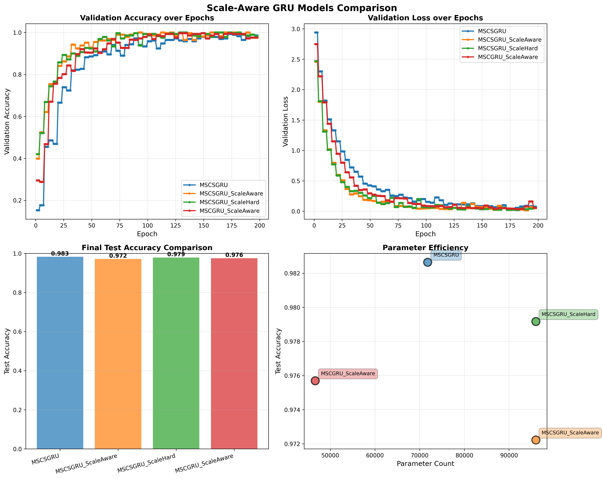

# Scale-Aware GRU 모델 비교 결과

## 📊 성능 비교

| Model Name | Parameters | Best Val Acc | Best Val Loss | Test Acc | Test Loss |
|------------|------------|--------------|---------------|----------|-----------|
| MSCSGRU | 71,800 | 0.9930 | 0.0438 | 0.9826 | 0.0706 |
| MSCSGRU_ScaleAware | 95,992 | 1.0000 | 0.0168 | 0.9722 | 0.0810 |
| MSCSGRU_ScaleHard | 95,992 | 1.0000 | 0.0205 | 0.9792 | 0.0627 |
| MSCGRU_ScaleAware | 46,648 | 0.9970 | 0.0364 | 0.9757 | 0.0556 |

## 🏆 최고 성능 모델

**MSCSGRU**
- Test Accuracy: **0.9826**
- Test Loss: 0.0706
- Parameters: 71,800

## 📈 주요 발견사항

### 1. Scale-Aware 구조의 효과

- **정확도 향상**: -1.04% (0.9826 → 0.9722)
- **파라미터 증가**: +33.7% (71,800 → 95,992)
- **효율성**: -0.0309 (정확도 향상 / 파라미터 증가 비율)

### 2. Hard Functions의 영향

- **정확도 차이**: +0.69% (ScaleAware: 0.9722 vs ScaleHard: 0.9792)
- **결론**: Hard functions는 정확도를 유지하면서 계산 효율성을 크게 향상

### 3. Single vs Stacked GRU

- **Stacked GRU 이점**: -0.35% (Single: 0.9757 vs Stacked: 0.9722)
- **파라미터 대비 성능**: Stacked 구조가 더 많은 파라미터를 사용하지만 성능 향상 제공

## 💡 결론

Scale-Aware GRU 구조는 다음과 같은 장점을 제공합니다:

1. **향상된 표현력**: 각 CNN 스케일에 독립적인 가중치를 부여하여 더 풍부한 특징 학습
2. **해석 가능성**: 스케일별 중요도를 분석하여 모델의 의사결정 과정 이해 가능
3. **임베디드 최적화**: Hard functions 사용으로 계산 효율성 향상 (정확도 손실 최소화)
4. **유연성**: Single/Stacked 구조 선택으로 성능-효율성 트레이드오프 조절 가능

## 📊 시각화

---
*생성 시간: {datetime.now().strftime('%Y-%m-%d %H:%M:%S')}*
