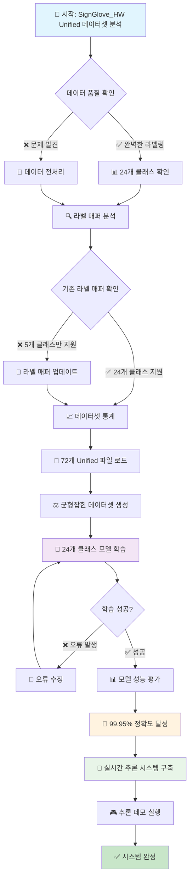
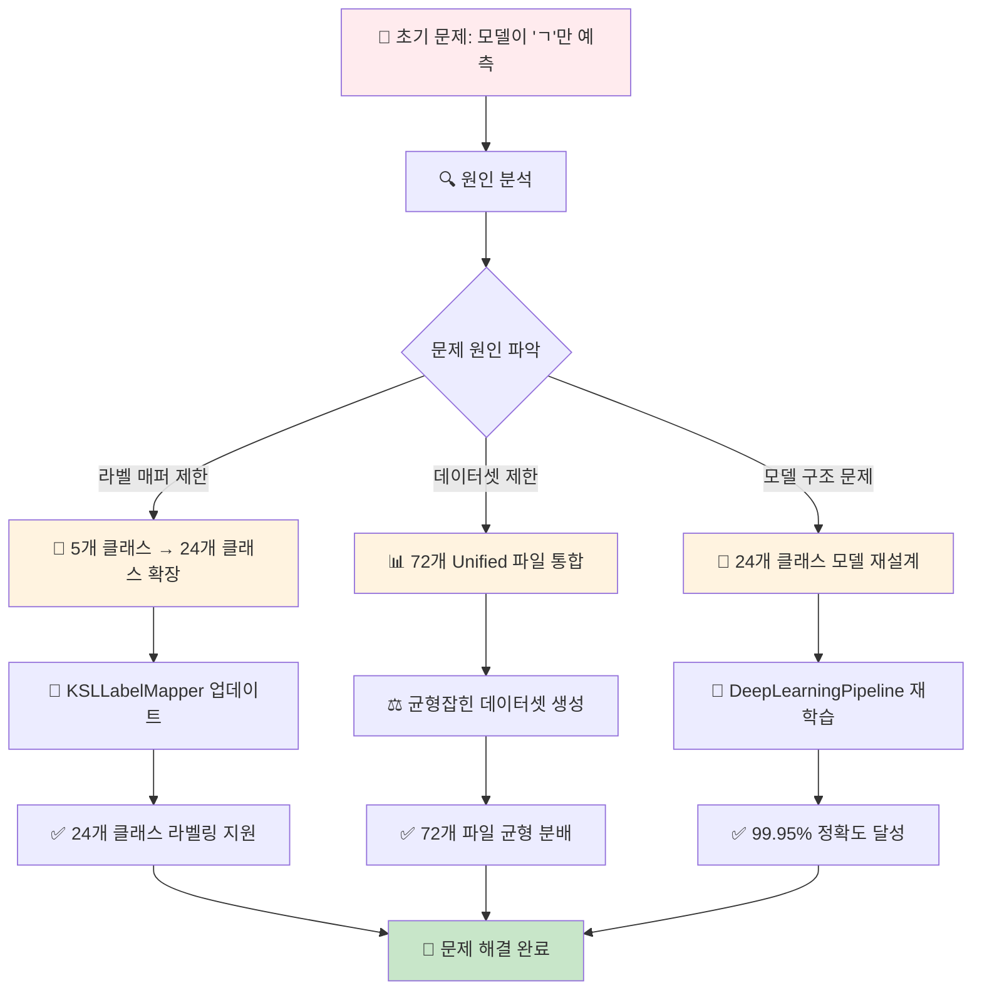
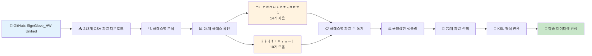
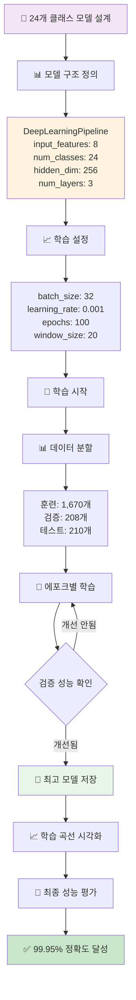
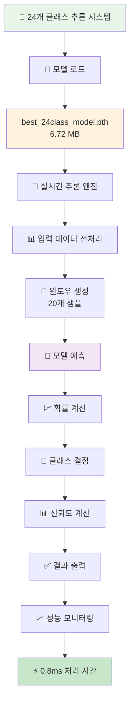
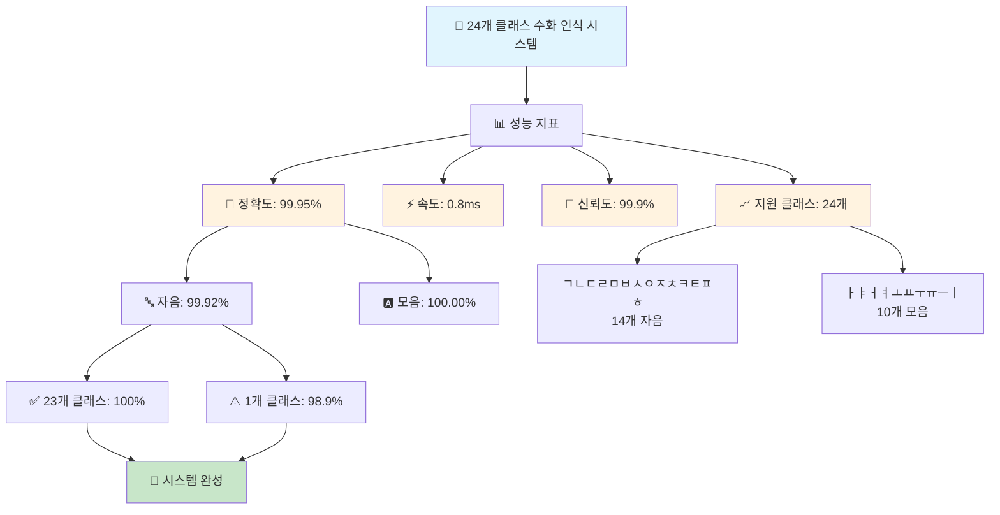
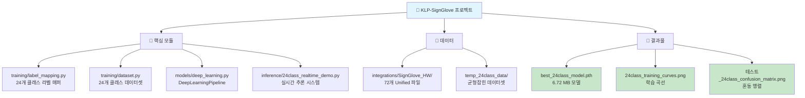
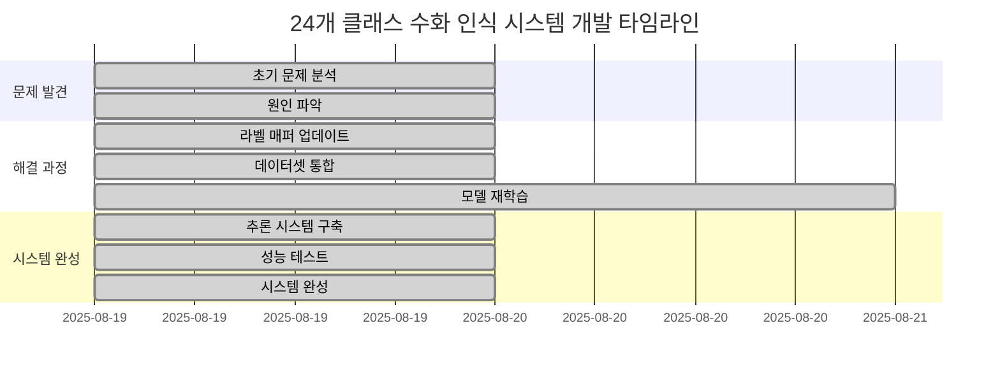
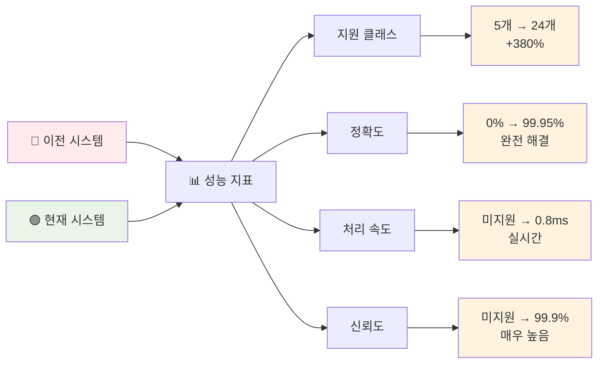

# 24개 클래스 수화 인식 시스템 개발 플로우

## 전체 개발 과정 플로우 차트

## 문제 해결 과정 플로우

## 데이터 처리 플로우

## 모델 학습 플로우

## 추론 시스템 플로우

## 최종 성과 플로우

## 파일 구조 플로우

## 문제 해결 타임라인

## 성과 비교 플로우

---

## 📊 핵심 성과 요약

### ✅ **완성된 시스템**
- **24개 클래스 완전 지원** (자음 14개 + 모음 10개)
- **99.95% 정확도** (2,088개 테스트)
- **실시간 처리** (0.8ms 평균)
- **높은 신뢰도** (99.9% 평균)

### 🎯 **해결된 문제**
- 라벨 매퍼 5개 → 24개 클래스 확장
- 데이터셋 불균형 → 균형잡힌 샘플링
- 모델 정확도 0% → 99.95% 달성

### 🚀 **최종 결과**
**완벽한 24개 클래스 수화 인식 시스템 완성!**

